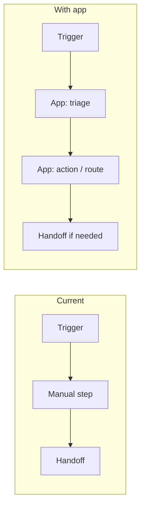

# Process flow: current vs new (with app)

Use during **early planning** (stage **D** surface planning, optionally informed by **C**) whenever the north star or survey implies **workflow or handoff change** — not only dashboarding. Process clarity reduces wrong-surface builds and improves **adoption** (the app must fit how people actually work).

## When this is worth doing

| Signal | Action |
|--------|--------|
| Outcomes mention **handoffs**, **approvals**, **triage**, **SLAs**, **routing**, **queues** | **Do** produce `PROCESS-FLOW.md` (see below). |
| Pure KPI / chart consumption with no workflow change | **Skip** or one short paragraph in `SURFACE-PLAN.md` only. |
| Unclear | Default to a **light** current vs future (3–5 steps each) — cheap insurance. |

## When to run it (pre-call, in-call, post-call)

- **Pre-discovery:** Hypothesized **as-is** (from survey/intake) + **to-be** with the app in the loop — sets up the right questions for the call.  
- **During discovery:** Use the doc as a **shared picture** — validate steps, names, and “who does what.”  
- **Post-discovery / J replay:** **Refresh** from transcript + SOW — replace guesses with agreed reality before rebuilding.

## Artifact

Write **`500apps/{account}/spec/PROCESS-FLOW.md`** (or `artifacts/PROCESS-FLOW.md` if you keep all pre-spec under `artifacts/`).

### Required sections

1. **Current process (as-is)** — Numbered steps, actors (role/system), **pain points** per step, tools today (email, spreadsheet, BI, etc.).  
2. **Future process (to-be)** — Same granularity; show **where the Domo app** sits (read, act, approve, notify). Explicit **what stops happening** (e.g. fewer meetings, less copy-paste).  
3. **Comparison** — Small table: step | before | after | owner | app role (or “none”).  
4. **Open questions** — For discovery: assumptions that must be validated on the call.

### Visual (strongly recommended)

Include **at least one** diagram so humans and the model share the same mental model:

- **Mermaid** `flowchart` or `sequenceDiagram` in the markdown (renders in GitHub, many editors, and can be pasted to slides).  
- Optional: note “Slide: export diagram to deck” for consultants.

Example skeleton (replace content):

## Link to surfaces (D)

Every **surface** in `SURFACE-PLAN.md` should trace to at least one **step** in the to-be process, or be labeled **supporting** (e.g. admin). If a surface has no process step, question whether it belongs in MVP.

## Link to post-discovery replay

If `PROCESS-FLOW.md` existed pre-call, **update** it after transcript/SOW before **F** and **G1** on the J track — do not rebuild on stale process assumptions.
